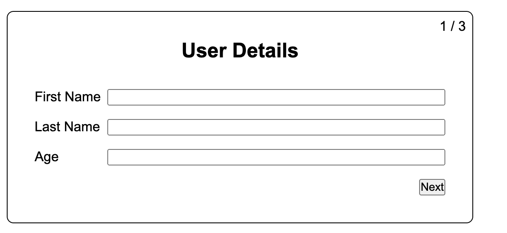
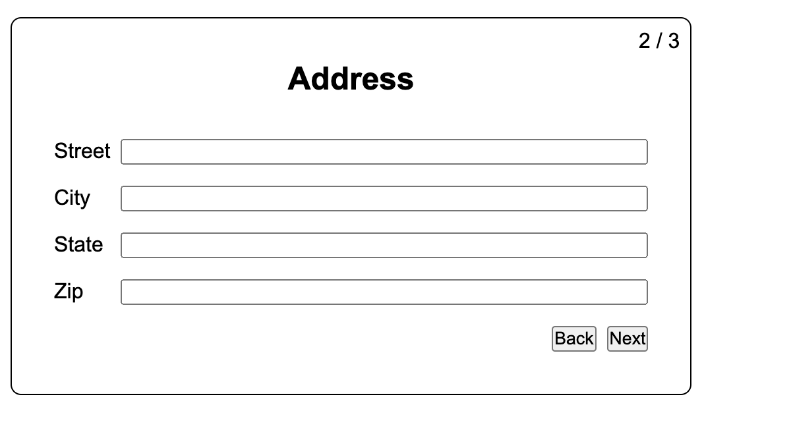
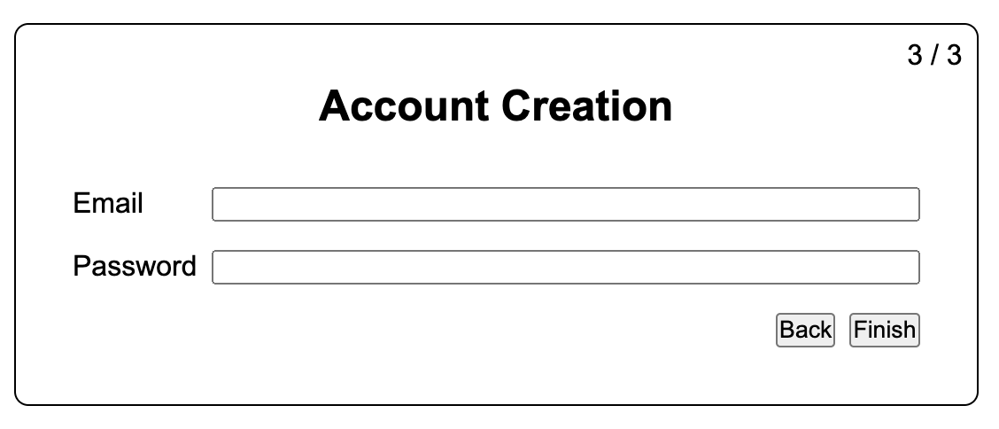

#### MultiPage Form Using React JS

## Approach
1. Created a new React App using `npm create vite@latest`.
2. Created separate components for each page (FirstPage, a SecondPage, and ThirdPage).
3. Create a custom hook `useMultiStepForm`.
4. Created a `App.js` file and used `useMultiStepForm` and imported all pages there.
5. Used `useState` to store the current step.
6. Update the current step as user fills the forms. 
7. Used `conditional rendering` to render the current step.
8. Submit the form on the last page.

